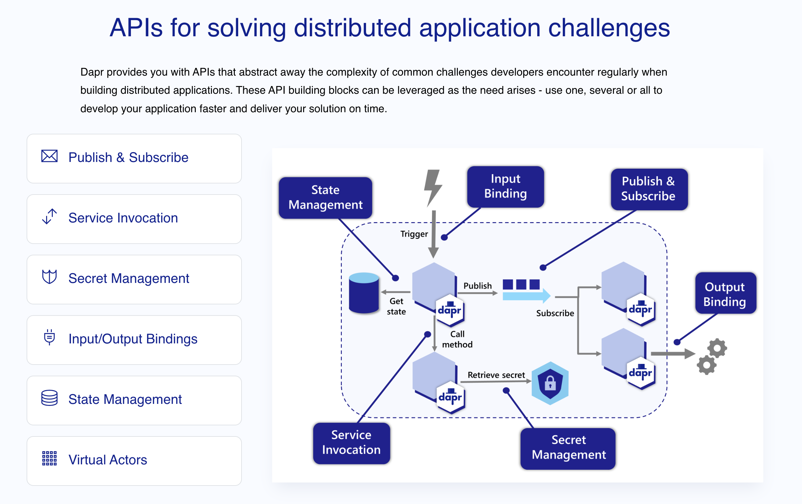
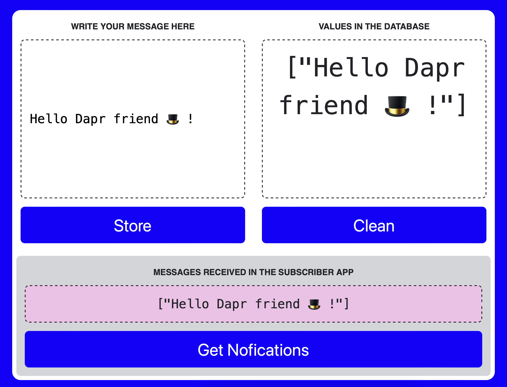
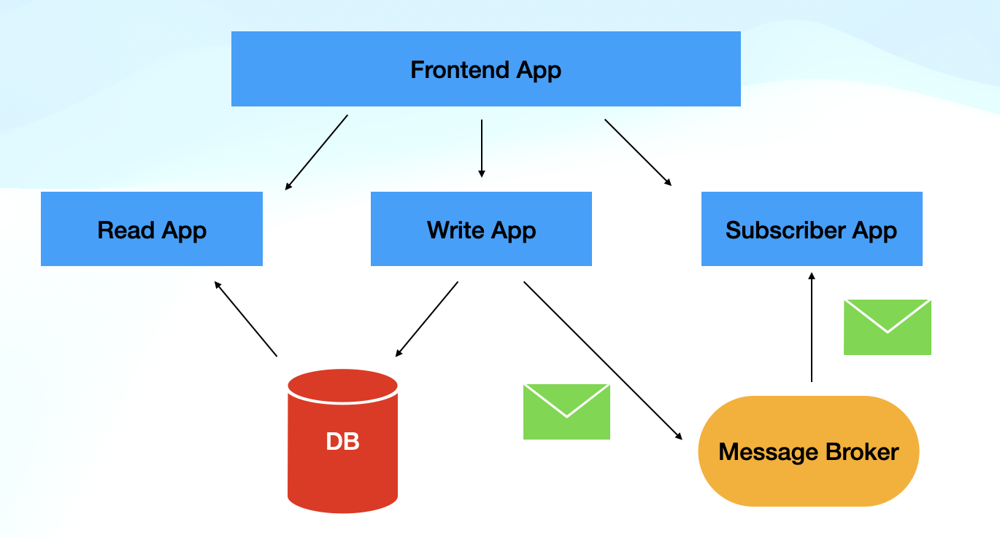

# Developing Distributed Applications with Dapr & Testcontainers

This repository contains some examples showing:
- A sample application using Dapr APIs to interact with infrastructure on top of Kubernetes
    - Services using Statestore and PubSub APIs
- The sample application using  Testcontainers for local development

Follow through for a step-by-step tutorial to get these applications running. 

# Dapr :: More APIs, less dependencies

These examples show how can developers, by using [Dapr](https://dapr.io), can focus on writing code against local APIs (HTTP/GRPC) to interact with common infrastructural components that can be hosted locally or in a Cloud Provider. 



These examples show how you can separate infrastructure components such as Databases or Message Brokers from Applications by decoupling their dependencies. The example application cover the Statestore and PubSub Dapr Components and their APIs. These two APIs allow applications to read and store state in a persistent storage (for this example Redis) and to emit and consume async events between services. 


# Testcontainers :: Wire Cloud-Native applications locally

But, working with tools like Dapr can push the developer to learn about how to use Kubernetes and containers which might add to much cognitive load. 

With [Testcontainers](https://testcontainers.com/) we can leverage Dapr and integrate with popular tools such as Spring Boot (for Java) to allow developers to keep using the tools that they already know but adding Dapr into the mix. 

By using Testcontainers we can wire some of the components that are managed by Kubernetes, for the applications that are running locally. Let's see this in action.

# Running this example in a Local Kubernetes Cluster

Create a KinD Cluster: 

```
cat <<EOF | kind create cluster --config=-
kind: Cluster
apiVersion: kind.x-k8s.io/v1alpha4
nodes:
- role: control-plane
  extraPortMappings:
  - containerPort: 31080 # expose port 31380 of the node to port 80 on the host, later to be use by kourier or contour ingress
    listenAddress: 127.0.0.1
    hostPort: 80
EOF

```

Install Knative Serving (this is optional): 

```
kubectl apply -f https://github.com/knative/serving/releases/download/knative-v1.10.2/serving-crds.yaml
kubectl apply -f https://github.com/knative/serving/releases/download/knative-v1.10.2/serving-core.yaml

```
Install Kourier as the Networking Layer: 

```
kubectl apply -f https://github.com/knative/net-kourier/releases/download/knative-v1.10.0/kourier.yaml

```
Configure domain mappings: 
```
kubectl apply -f https://github.com/knative/serving/releases/download/knative-v1.10.2/serving-default-domain.yaml

```

And if you are running on KinD: 

```
kubectl patch configmap -n knative-serving config-domain -p "{\"data\": {\"127.0.0.1.sslip.io\": \"\"}}"
```
And: 
```
cat <<EOF | kubectl apply -f -
apiVersion: v1
kind: Service
metadata:
  name: kourier-ingress
  namespace: kourier-system
  labels:
    networking.knative.dev/ingress-provider: kourier
spec:
  type: NodePort
  selector:
    app: 3scale-kourier-gateway
  ports:
    - name: http2
      nodePort: 31080
      port: 80
      targetPort: 8080
EOF
```

Install Dapr: 

```
helm repo add dapr https://dapr.github.io/helm-charts/
helm repo update
helm upgrade --install dapr dapr/dapr \
--version=1.10.1 \
--namespace dapr-system \
--create-namespace \
--wait
```

Install Redis in Kubernetes using Helm 

```
helm install redis bitnami/redis --set architecture=standalone
```

You can install the sample application by running: 

```
helm install app oci://docker.io/salaboy/dapr-testcontainers-app --version v0.1.0
```

# What is the application doing? 

This simple application looks like this: 



The application allow the user to write a message using the left-hand side box. The messages stored are read in the right-hand side box. At the bottom of the application the user can fetch all the asyncronous notifications that were generated by these or other services. 

The application is composed by three backend services and one frontend: 
- **read-app**: read information from a persistent storage
- **write-app**: write information from a persistent storage
- **subscriber-app**: it is subscribed to events that other services are generating




# Local Development with Testcontainers

Now imagine, that you don't want developers to go through installing a local Kubernetes Cluster and creating containers. You want them to use the tools that they already know such as Spring Boot for Java but also leverage the API approach provided by Dapr. 


**NOTE**: For these applications to share the infrastructure components you should configure the TestContainers `reuse` mode in the file `~/.testcontainers.properties` add `testcontainers.reuse.enable = true`


In local development, you want to start the same services that we deployed to Kubernetes but locally. Depending on which technology stack you are using to develop each service, is the workflow that developers will adopt to run these services locally. 
Because the application is composed by multiple services, it will be important to have a simple way to start them all and make sure that they are wired together (meaning that they can talk to each other or access to shared infrastructural components).

You can start each service with: 
```
mvn spring-boot:test-run
``` 

from inside each service directory (`read-app/`, `write-app/`, `subscriber-app/`). 

By running these application with `run-test` we are leveraging the Testcontainers configurations, usually being used to do integration tests for our services, but for local development. 

As these configurations are all starting the Dapr Sidecar and configuring the infrastructure components, developers can focus on writing code and their applications are smaller as they don't need to include any clients or drivers to their applications. 

Once the services (`read-app`,`write-app` and `subscriber-app`) are started, you can send requests to check that the services are accessing the same infrastructure as well as using the Dapr APIs. 

Send a request to the `write-app` (running on the port 8081):
```
curl -X POST "http://localhost:8081/?message=hello-world"
```

Check now that the `read app` (running on the port 8080) is getting the value that we sent to the `write-app`:
```
curl http://localhost:8080/
```

Finally, you can check the logs from the `subscriber-app` to see that it received a notification or use the application APIs (running on the port 8082): 

```
curl http://localhost:8082/notifications
```


Enjoy your local development experience with Dapr and Testcontainers :metal:

### Clean up Local Environment 

Remove all running Docker Containers: 
```
docker rm -f $(docker ps -aq)
```
